<div align="center">

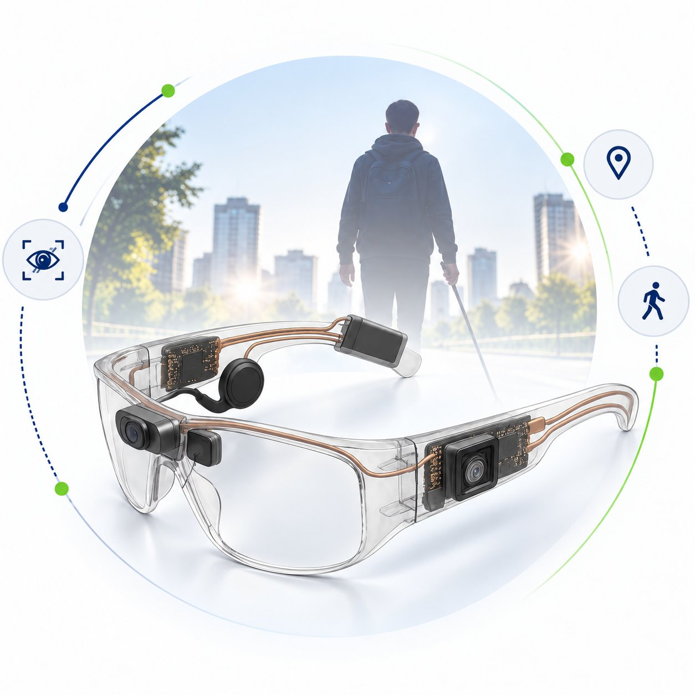

# Third Eye

### AI-Powered Smart Glasses for Assisted Vision

*See. Hear. Understand. Respond. Be independent.*

**Team Tech Fungus · Roorkee Institute of Technology, Roorkee**

</div>

---

## 🎬 Videos

### Demo

<p align="center">
  <a href="https://youtu.be/cIXQx1PoyvY?feature=shared">
    
  </a>
  <br />
  <a href="https://youtu.be/cIXQx1PoyvY?feature=shared">▶ Watch the demo on YouTube</a>
</p>

### Promo

<!-- PROMO PLACEHOLDER: upload the promo to readme/ and update this link if the filename changes -->
<p align="center">
  

https://github.com/user-attachments/assets/7b9b2220-8318-4f09-818e-c5570719d97b


</p>

---

## 🧭 About the Project

Over **2.2 billion people** worldwide, including **34 million+ in India**, live with some form of vision impairment. The tools available to them are often outdated, expensive and fragmented. Simple everyday moments like crossing a road, reading a signboard or paying at a shop can become dangerous or dependent on someone else.

**Third Eye** is an affordable, AI-powered wearable that gives visually impaired and elderly users real-time awareness of their surroundings. It combines computer vision, a conversational voice assistant and secure UPI payments in one pair of glasses, all **hands-free and voice-first**.

<p align="center">
  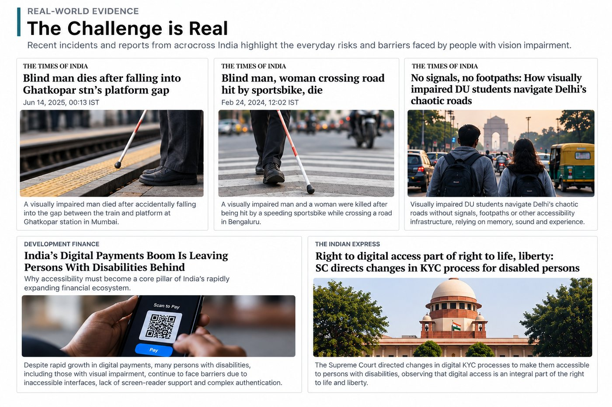
</p>

---

## ✨ Features: Three Modes, One Device

| Mode | What it does |
| --- | --- |
| 🛡️ **Active Mode** | Continuously scans surroundings with **YOLOv8** and gives instant audio alerts for vehicles, people, obstacles and hazards, including direction and approximate distance. |
| 💬 **Passive Mode** | On-demand assistant. Ask *"What's in front of me?"* or *"Read this sign"*. **OCR + Gemini** give a natural spoken answer. |
| 💳 **Payment Mode** | Scans a **UPI QR code**, confirms the amount by voice and verifies with **fingerprint authentication**. No screen needed. |
| 📴 **Offline Mode** | Local YOLOv8 detection server keeps safety alerts working without internet. |

**Why it's different**

- First-of-its-kind system combining navigation, AI interaction and secure UPI payments in a single wearable
- Context-aware guidance: *"vehicle approaching on your left"*, not just *"object detected"*
- Built for complete independence, from safe movement to cashless transactions without assistance
- About **₹10,000** per unit, a fraction of the cost of existing assistive devices

<p align="center">
  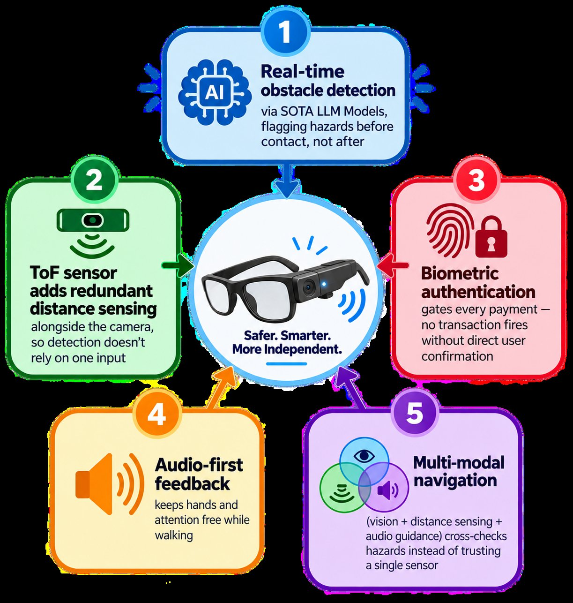
  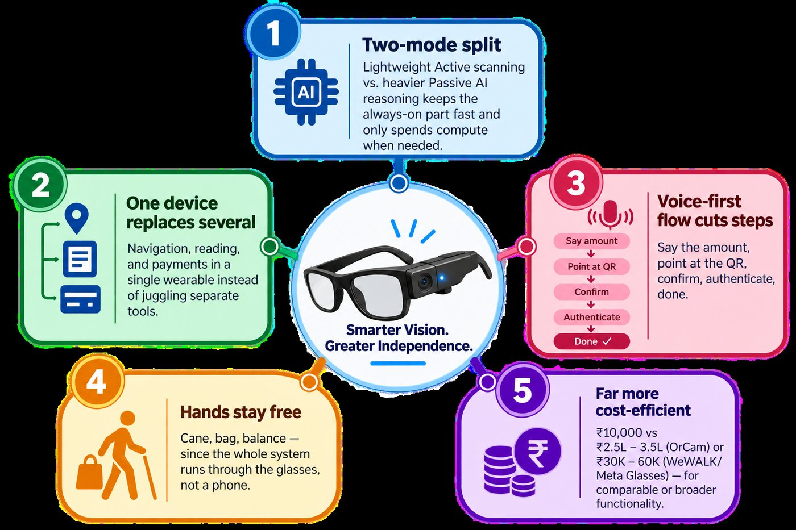
</p>

---

## 🔧 Hardware

<p align="center">
  
</p>

<div align="center">
<table width="100%">
  <thead>
    <tr>
      <th align="center" width="40%">Component</th>
      <th align="center" width="60%">Role</th>
    </tr>
  </thead>
  <tbody>
    <tr><td align="center">Camera (ESP32-CAM)</td><td align="center">Live video feed for detection, OCR and QR scanning</td></tr>
    <tr><td align="center">ESP32 controller</td><td align="center">Sensor handling and Wi-Fi / WebSocket communication</td></tr>
    <tr><td align="center">ToF sensor</td><td align="center">Real-time distance measurement</td></tr>
    <tr><td align="center">Fingerprint sensor</td><td align="center">Biometric authentication for payments</td></tr>
    <tr><td align="center">Touch / button control</td><td align="center">Mode switching</td></tr>
    <tr><td align="center">Speaker / audio feedback</td><td align="center">Spoken alerts and responses</td></tr>
    <tr><td align="center">Li-Po battery module</td><td align="center">Portable power and charging</td></tr>
  </tbody>
</table>
</div>

---

## ⚙️ How It Works

<p align="center">
  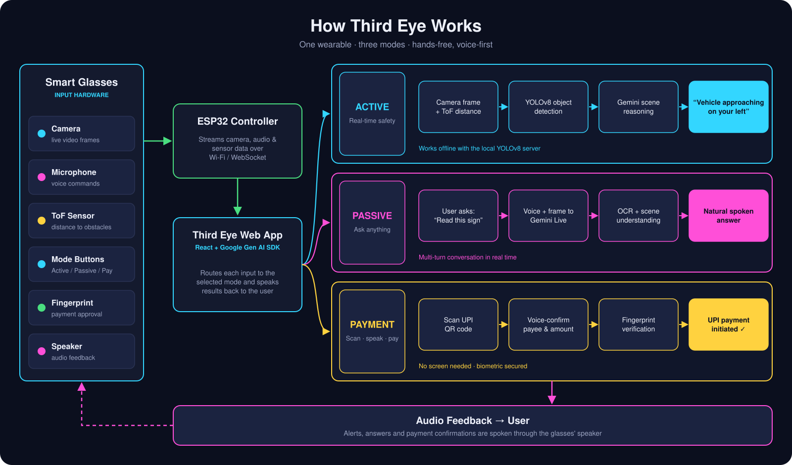
</p>

1. The user presses a button on the glasses to choose a mode.
2. The ESP32 camera streams frames, and the mic streams audio to the web app.
3. **Active:** YOLOv8 detects objects, and Gemini turns the detections into short spoken safety cues.
4. **Passive:** the user speaks a question, and Gemini Live answers in real time using what the camera sees.
5. **Payment:** a QR code is scanned, the UPI ID is extracted, the amount is confirmed by voice, the fingerprint is verified and the payment is initiated.

---

## 🖥️ Internal Dashboard & Prototype

<p align="center">
  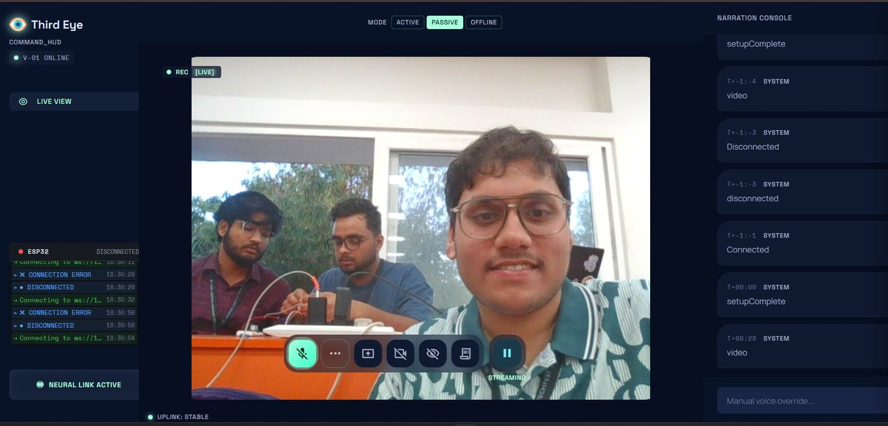
</p>

<p align="center">
  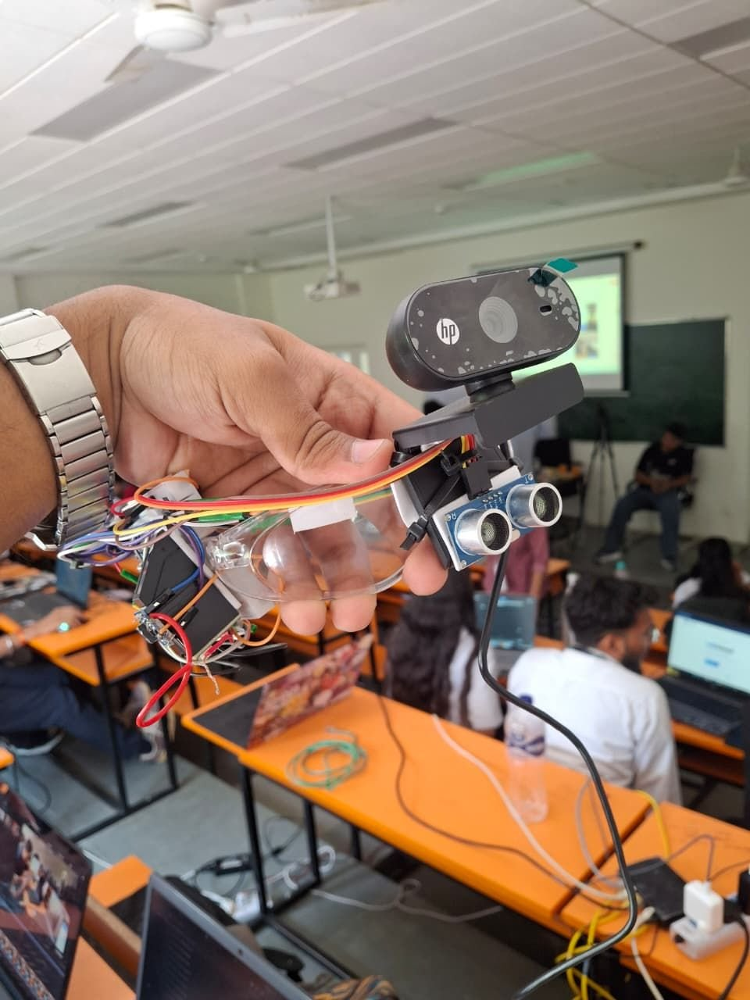
  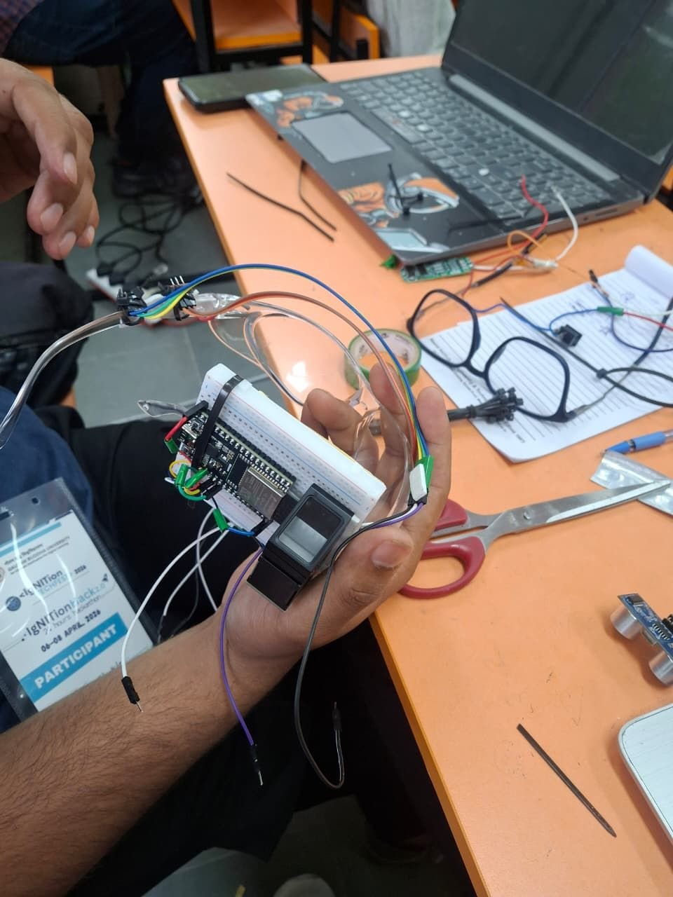
  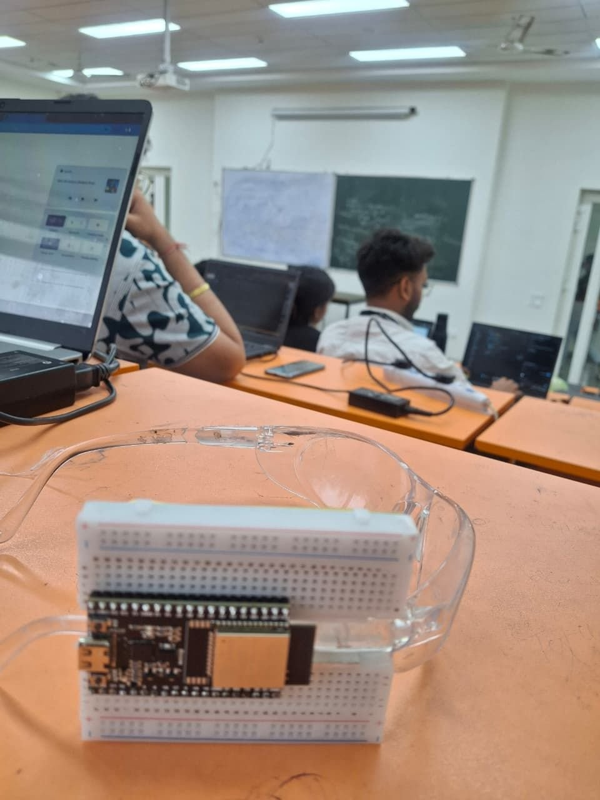
  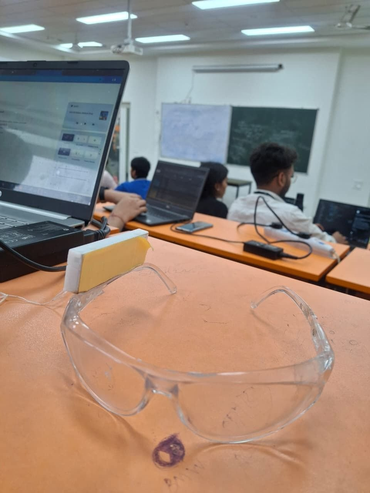
</p>

---

## 🧰 Tech Stack

| Layer | Technology |
| --- | --- |
| Frontend | TypeScript, React, SASS, Zustand |
| AI (live) | Google Gen AI SDK: `gemini-3.1-flash-live-preview` / `gemini-2.5-flash-native-audio-preview-12-2025` |
| AI (polled) | `gpt-oss-20b` (alternatively `google/gemma-4-26b`) |
| Vision | YOLOv8 (Ultralytics), OCR, `qr-scanner` |
| Offline server | Python, FastAPI, OpenCV, Ultralytics |
| Payment server | Node.js, Express (UPI deep links + transaction verification) |
| Hardware | ESP32 / ESP32-CAM, fingerprint sensor, ToF sensor (Arduino sketches) |
| Database | MongoDB (user state) |

---

## 📁 Repository Structure

```
third_eye/
├── src/            # React + TypeScript web app (Gemini Live client, modes, UI)
├── server/         # Express UPI payment server (port 3001)
├── offline_mode/   # FastAPI + YOLOv8 offline detection server (port 8765)
├── esp32/          # ESP32 sketches: camera, buttons, fingerprint auth
├── public/         # Static assets
└── readme/         # README images and videos
```

---

## 🚀 Getting Started

### 1. Web app

```bash
npm install
```

Create a `.env` file in the project root:

```env
REACT_APP_GEMINI_API_KEY=your_gemini_api_key   # https://aistudio.google.com/apikey
REACT_APP_ESP32_IP=192.168.x.x:81              # IP of your ESP32 camera
```

```bash
npm start          # http://localhost:3000
```

### 2. Payment server

```bash
npm install express cors
node server/index.js   # http://localhost:3001
```

Endpoints: `POST /api/initiate-payment`, `POST /api/verify-payment`, `GET /api/transaction/:id`, `GET /api/transactions`

### 3. Offline detection server (optional)

```bash
cd offline_mode
pip install fastapi uvicorn ultralytics opencv-python pydantic pywin32
python server.py       # http://localhost:8765  (POST /detect, GET /health)
```

### 4. ESP32 firmware

Flash the sketches in `esp32/` with the Arduino IDE:

- `espcodev2.ino`: camera streaming
- `button_controller.ino`: mode buttons
- `espcode_fingerprint.ino`: fingerprint authentication over WebSocket

---

## 📊 Market & Impact

<p align="center">
  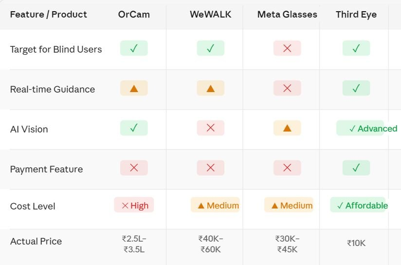
</p>

- **Target market:** ~35M visually impaired people in India, ~2.2B globally
- **Unit economics:** ~₹6,000 cost, ₹10,000 selling price (~40% gross margin)
- **Business model:** direct sales (B2C), B2B / B2G partnerships, premium subscription, maintenance & support

<p align="center">
  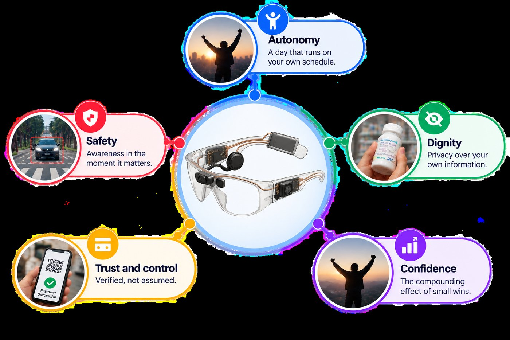
</p>

### Roadmap

- Compact all-in-one glasses (camera, ESP32, battery, mic and speaker in the frame)
- GPS and indoor navigation (malls, hospitals, airports)
- Full smartphone control by voice
- Personalized AI that adapts to user habits
- On-device edge AI for fully offline use

---

## 👥 Team Tech Fungus

<p align="center">
  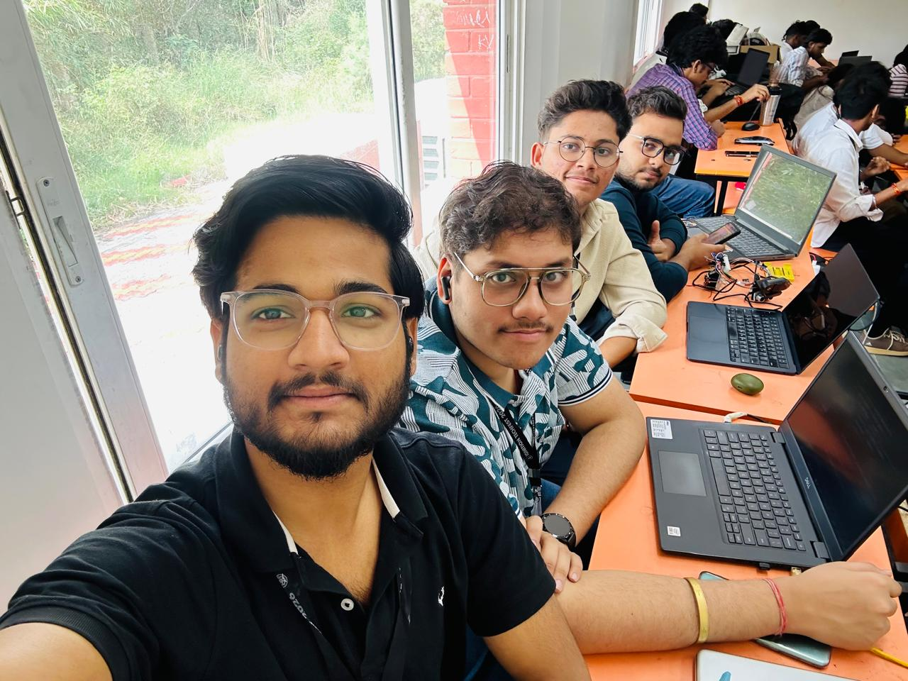
</p>

| Name | LinkedIn |
| --- | --- |
| Aditya Raj | [LinkedIn](https://www.linkedin.com/in/your-profile) |
| Ashwani Raj | [LinkedIn](https://www.linkedin.com/in/your-profile) |
| Harsh Raj Shukla | [LinkedIn](https://www.linkedin.com/in/your-profile) |
| Priyanshu Roushan | [LinkedIn](https://www.linkedin.com/in/your-profile) |
| Anamika | [LinkedIn](https://www.linkedin.com/in/your-profile) |
| Mansi | [LinkedIn](https://www.linkedin.com/in/your-profile) |
